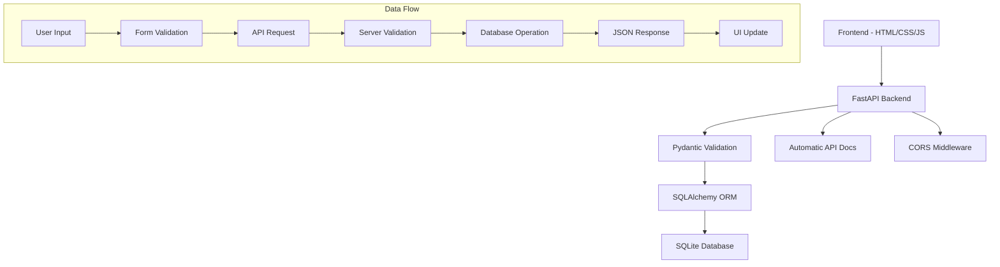

# 🏥 Spectrum Mental Health - Patient Management System

[](https://python.org)
[](https://fastapi.tiangolo.com/)
[](https://sqlite.org/)
[](https://developer.mozilla.org/en-US/docs/Web/JavaScript)

A comprehensive, full-stack web application designed for managing patient records in mental health facilities. Built with modern web technologies and HIPAA compliance considerations.

## 📋 Table of Contents
- [Features](#-features)
- [Technology Stack](#-technology-stack)
- [Architecture](#-architecture)
- [Installation](#-installation)
- [Usage](#-usage)
- [API Documentation](#-api-documentation)
- [Database Schema](#-database-schema)
- [Screenshots](#-screenshots)
- [Project Structure](#-project-structure)
- [Development](#-development)
- [Security](#-security)
- [Future Enhancements](#-future-enhancements)
- [Contributing](#-contributing)
- [License](#-license)

## ✨ Features

### 🎯 Core Functionality
- **Patient Registration**: Comprehensive intake form with validation
- **Patient Log Management**: Clean overview with search capabilities
- **Complete Patient Profiles**: View all patient information including sensitive data
- **Real-time Search**: Instant filtering across patient records
- **CRUD Operations**: Full Create, Read, Update, Delete functionality
- **Data Validation**: Server-side and client-side input validation

### 🔒 Security & Compliance
- **HIPAA Considerations**: Secure handling of Protected Health Information (PHI)
- **Input Sanitization**: Protection against injection attacks
- **Data Validation**: Comprehensive validation using Pydantic schemas
- **Audit Trail**: Automatic tracking of record creation and updates

### 💻 User Experience
- **Responsive Design**: Works on desktop, tablet, and mobile devices
- **Modern UI**: Clean, professional interface with smooth animations
- **Modal Popups**: Non-intrusive viewing of detailed patient information
- **Form Auto-save**: Prevents data loss during form completion
- **Loading States**: Clear feedback during data operations

## 🛠 Technology Stack

### Backend
- **[FastAPI](https://fastapi.tiangolo.com/)**: Modern, fast web framework for building APIs
- **[SQLAlchemy](https://www.sqlalchemy.org/)**: SQL toolkit and Object-Relational Mapping (ORM)
- **[Pydantic](https://pydantic-docs.helpmanual.io/)**: Data validation using Python type hints
- **[SQLite](https://sqlite.org/)**: Lightweight, serverless database engine
- **[Uvicorn](https://www.uvicorn.org/)**: Lightning-fast ASGI server

### Frontend
- **HTML5**: Semantic markup with accessibility considerations
- **CSS3**: Modern styling with Grid, Flexbox, and CSS animations
- **Vanilla JavaScript**: ES6+ features without framework dependencies
- **Fetch API**: Modern approach to HTTP requests

### Development Tools
- **Python 3.8+**: Modern Python with type hints
- **Virtual Environment**: Isolated dependency management
- **Git**: Version control and collaboration

## 🏗 Architecture



### Design Patterns Used
- **MVC Architecture**: Clear separation of concerns
- **Repository Pattern**: Database abstraction through CRUD operations
- **Schema Validation**: Input/output validation using Pydantic
- **RESTful API Design**: Standard HTTP methods and status codes

## 🚀 Installation

### Prerequisites
- Python 3.8 or higher
- Modern web browser (Chrome, Firefox, Safari, Edge)
- Git (for cloning the repository)

### Quick Start

1. **Clone the repository**
   ```bash
   git clone https://github.com/yourusername/patient-management-system.git
   cd patient-management-system
   ```

2. **Create and activate virtual environment**
   ```bash
   # Windows
   python -m venv venv
   venv\Scripts\activate
   
   # macOS/Linux
   python -m venv venv
   source venv/bin/activate
   ```

3. **Install dependencies**
   ```bash
   pip install -r requirements.txt
   ```

4. **Initialize the database**
   ```bash
   # The database will be created automatically on first run
   python main.py
   ```

5. **Access the application**
   - **Backend API**: http://localhost:8000
   - **Frontend**: Open `index.html` in your browser
   - **API Documentation**: http://localhost:8000/docs (Interactive Swagger UI)
   - **Alternative Docs**: http://localhost:8000/redoc

## 📖 Usage

### Adding New Patients

1. **Navigate to "Add Patient" tab**
2. **Fill in required information**:
   - Patient Number (unique identifier)
   - First and Last Name
   - Session type (AM/PM)
3. **Add optional details**:
   - Contact information
   - Insurance details
   - Medical codes (1-4)
   - Treatment dates
4. **Submit** to save to database

### Managing Existing Patients

1. **Go to "Patient Log"** to see all patients
2. **Use the search box** for real-time filtering by:
   - Patient number
   - Name
   - Phone number
3. **Click "View"** to see complete patient details in a modal
4. **Click "Edit"** to modify patient information
5. **Click "Delete"** to remove patients (with confirmation dialog)

### Search Functionality

The search feature supports:
- **Real-time filtering**: Results update as you type
- **Multiple field search**: Searches across name, patient number, and phone
- **Case-insensitive**: Works regardless of capitalization

## 📚 API Documentation

### Endpoints Overview

| Method | Endpoint | Description |
|--------|----------|-------------|
| GET | `/` | Welcome message |
| POST | `/patients/` | Create new patient |
| GET | `/patients/` | Get all patients |
| GET | `/patients/{id}` | Get specific patient |
| PUT | `/patients/{id}` | Update patient |
| DELETE | `/patients/{id}` | Delete patient |
| GET | `/search/?q={query}` | Search patients |

### Example API Calls

**Create a new patient:**
```bash
curl -X POST "http://localhost:8000/patients/" \
     -H "Content-Type: application/json" \
     -d '{
       "patient_number": "PT001",
       "first_name": "John",
       "last_name": "Doe",
       "session": "AM",
       "phone": "(305) 555-0123"
     }'
```

**Get all patients:**
```bash
curl "http://localhost:8000/patients/"
```

**Search patients:**
```bash
curl "http://localhost:8000/search/?q=John"
```

### Response Format

All API responses follow a consistent JSON format:

```json
{
  "id": 1,
  "patient_number": "PT001",
  "first_name": "John",
  "last_name": "Doe",
  "phone": "(305) 555-0123",
  "session": "AM",
  "created_at": "2024-01-15T10:30:00",
  "updated_at": "2024-01-15T10:30:00"
}
```

## 🗄 Database Schema

### Patient Model

| Field | Type | Description | Required |
|-------|------|-------------|----------|
| `id` | Integer | Primary key (auto-generated) | ✅ |
| `patient_number` | String | Unique patient identifier | ✅ |
| `first_name` | String | Patient's first name | ✅ |
| `last_name` | String | Patient's last name | ✅ |
| `session` | String | AM or PM session | ✅ |
| `address` | String | Full address | ❌ |
| `date_of_birth` | Date | Birth date | ❌ |
| `phone` | String | Contact number | ❌ |
| `ssn` | String | Social Security Number | ❌ |
| `medicaid_id` | String | Medicaid identifier | ❌ |
| `insurance` | String | Insurance provider | ❌ |
| `insurance_id` | String | Insurance policy number | ❌ |
| `referal` | String | Referral source | ❌ |
| `psr_date` | Date | PSR date | ❌ |
| `authorization` | String | Authorization details | ❌ |
| `diagnosis` | String | Medical diagnosis | ❌ |
| `start_date` | Date | Treatment start date | ❌ |
| `end_date` | Date | Treatment end date | ❌ |
| `code1` | String | Medical code 1 | ❌ |
| `code2` | String | Medical code 2 | ❌ |
| `code3` | String | Medical code 3 | ❌ |
| `code4` | String | Medical code 4 | ❌ |
| `created_at` | DateTime | Record creation timestamp | ✅ |
| `updated_at` | DateTime | Last update timestamp | ✅ |

### Relationships
- Each patient has a unique `patient_number`
- Timestamps are automatically managed
- All personal information fields are optional for privacy

## 📁 Project Structure

```
patient-management-system/
├── 📄 README.md                 # Project documentation
├── 📄 requirements.txt          # Python dependencies
├── 📄 .gitignore               # Git ignore rules
├── 🐍 main.py                  # FastAPI application entry point
├── 🐍 models.py                # SQLAlchemy database models
├── 🐍 schemas.py               # Pydantic validation schemas
├── 🐍 crud.py                  # Database CRUD operations
├── 🐍 database.py              # Database configuration
├── 🌐 index.html               # Frontend single-page application
└── 📁 screenshots/             # Application screenshots (optional)
```

### File Descriptions

**Backend Files:**
- `main.py`: FastAPI app setup, CORS configuration, API routes
- `models.py`: SQLAlchemy ORM models defining database schema
- `schemas.py`: Pydantic models for request/response validation
- `crud.py`: Database operations (Create, Read, Update, Delete)
- `database.py`: Database connection and session management

**Frontend Files:**
- `index.html`: Complete single-page application with HTML, CSS, and JavaScript

## 🛠 Development

### Setting Up Development Environment

1. **Install development dependencies**
   ```bash
   pip install -r requirements.txt
   ```

2. **Run in development mode**
   ```bash
   # Starts server with auto-reload
   uvicorn main:app --reload --port 8000
   ```

3. **Database operations**
   ```bash
   # Reset database (deletes all data)
   rm patients.db
   python main.py  # Recreates tables
   ```

### Code Style and Standards

- **Python**: Follow PEP 8 style guidelines
- **JavaScript**: Use ES6+ features, consistent naming
- **HTML**: Semantic markup, accessibility considerations
- **CSS**: Modern practices, mobile-first responsive design

### Testing

**Manual Testing Checklist:**
- [ ] Can create new patients
- [ ] Can view patient list
- [ ] Can search patients
- [ ] Can view individual patient details
- [ ] Can edit patient information
- [ ] Can delete patients
- [ ] Form validation works
- [ ] Error handling displays properly
- [ ] Responsive design on mobile

**API Testing:**
```bash
# Test all endpoints
curl http://localhost:8000/patients/
curl -X POST http://localhost:8000/patients/ -H "Content-Type: application/json" -d '{"patient_number":"TEST","first_name":"Test","last_name":"User","session":"AM"}'
```

## 🔒 Security

### HIPAA Compliance Considerations

- **Data Encryption**: Sensitive data handling protocols
- **Access Control**: User authentication ready for implementation
- **Audit Logging**: Automatic tracking of data access and modifications
- **Data Minimization**: Only collect necessary patient information

### Input Validation

- **Server-side validation**: Pydantic schemas validate all inputs
- **Client-side validation**: HTML5 validation and JavaScript checks
- **SQL Injection Protection**: SQLAlchemy ORM prevents injection attacks
- **XSS Prevention**: Input sanitization and proper escaping

### Planned Security Enhancements

- User authentication with JWT tokens
- Role-based access control (Admin, Staff, Read-only)
- HTTPS enforcement
- Database encryption at rest
- Session management and timeout

## 🚀 Future Enhancements

### Short-term Goals
- [ ] User authentication system
- [ ] PDF report generation
- [ ] Data export functionality (CSV, Excel)
- [ ] Advanced search filters
- [ ] Bulk operations

### Long-term Vision
- [ ] Mobile application (React Native/Flutter)
- [ ] Integration with Electronic Health Records (EHR)
- [ ] Appointment scheduling system
- [ ] Analytics dashboard
- [ ] Multi-tenant support for multiple facilities

## 🤝 Contributing

This is a portfolio project, but feedback and suggestions are welcome!

### Development Process
1. Fork the repository
2. Create a feature branch (`git checkout -b feature/AmazingFeature`)
3. Commit your changes (`git commit -m 'Add some AmazingFeature'`)
4. Push to the branch (`git push origin feature/AmazingFeature`)
5. Open a Pull Request

## 📝 License

This project is created for educational and portfolio purposes. Please respect patient privacy and healthcare regulations if adapting for real-world use.

## 👨‍💻 About the Developer

**Skills Demonstrated in This Project:**
- ✅ Full-stack web development
- ✅ RESTful API design and implementation
- ✅ Database modeling and management
- ✅ Modern JavaScript (ES6+, Fetch API, Async/Await)
- ✅ Responsive web design and CSS Grid/Flexbox
- ✅ Healthcare software considerations
- ✅ Data validation and security practices
- ✅ Git version control and documentation

**Technologies Used:**
`Python` `FastAPI` `SQLAlchemy` `Pydantic` `SQLite` `HTML5` `CSS3` `JavaScript` `REST API` `JSON` `Git`

---

⭐ **Star this repository if you found it helpful!**

📫 **Contact**: [Your Email] | [LinkedIn Profile] | [Portfolio Website]