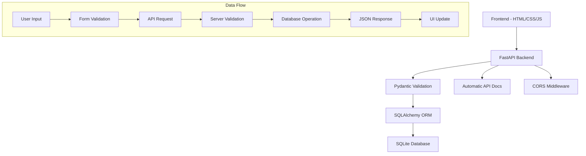

# 🏥 Spectrum Mental Health - Patient Management System

[](https://python.org)
[](https://fastapi.tiangolo.com/)
[](https://sqlite.org/)
[](https://developer.mozilla.org/en-US/docs/Web/JavaScript)

A comprehensive, full-stack web application designed for managing patient appointments and records in mental health facilities. Built with modern web technologies and featuring an intuitive calendar system with recurring appointment scheduling.

## 📋 Table of Contents
- [Features](#-features)
- [Technology Stack](#-technology-stack)
- [Architecture](#-architecture)
- [Installation](#-installation)
- [Usage](#-usage)
- [API Documentation](#-api-documentation)
- [Database Schema](#-database-schema)
- [Screenshots](#-screenshots)
- [Project Structure](#-project-structure)
- [Development](#-development)
- [Security](#-security)
- [Future Enhancements](#-future-enhancements)
- [Contributing](#-contributing)
- [License](#-license)

## ✨ Features

### 🎯 Core Functionality
- **Interactive Calendar**: Visual appointment tracking with date selection
- **Service Type Management**: Standardized service types (PSR, TMS, Individual Therapy, Evaluations)
- **Time-Based Scheduling**: 12-hour AM/PM time selection in 15-minute increments
- **Recurring Appointments**: Weekly or monthly recurring appointment scheduling
- **Attendance Tracking**: Record and visualize patient attendance
- **Patient Registration**: Comprehensive intake form with validation
- **Patient Log Management**: Clean overview with search capabilities
- **Service Sheets**: Dedicated attendance and appointment sheets for each patient
- **Real-time Updates**: UI updates immediately after changes without page reload
- **Multi-User Support**: User management with role-based access control

### 📅 Calendar & Appointment Features
- **Visual Indicators**: Color-coded appointment status on calendar
- **Attendance Status**: Track attended, missed, or pending appointments
- **Recurring Appointment Support**: Configure appointments to repeat weekly/monthly
- **Weekday-Only Scheduling**: Option to exclude weekends for recurring appointments
- **Date-Based Service Entry**: Add services by clicking directly on calendar dates
- **Quick View**: See all appointments for a selected date
- **Attendance Management**: Update attendance status directly from calendar view

### 🔒 Security & Compliance
- **User Authentication**: JWT-based secure authentication system
- **Role-Based Access**: Control what different users can view or modify
- **Input Validation**: Server-side and client-side input validation
- **Secure API**: Protected endpoints requiring authentication
- **Automatic Port Selection**: Finds available port if default is in use

### 💻 User Experience
- **Responsive Design**: Works on desktop, tablet, and mobile devices
- **Modern UI**: Clean, professional interface with intuitive navigation
- **Modal System**: Non-intrusive information display and form entry
- **Alert System**: Customizable alerts that appear above modals
- **Search Capabilities**: Instant filtering across patient records
- **Dynamic Form Population**: Auto-selection based on dates and service types

## ✨ Key Features Spotlight

### 🗓️ Interactive Calendar System
```
┌─────────────────────────────────────┐
│           July 2025                 │
├───┬───┬───┬───┬───┬───┬───┐         │
│Sun│Mon│Tue│Wed│Thu│Fri│Sat│         │
├───┼───┼───┼───┼───┼───┼───┤         │
│   │ 1 │ 2*│ 3 │ 4*│ 5 │ 6 │  Legend:│
├───┼───┼───┼───┼───┼───┼───┤  * = has appointments │
│ 7 │ 8*│ 9*│10 │11*│12 │13 │  ✓ = attended         │
├───┼───┼───┼───┼───┼───┼───┤  ✗ = no-show          │
│14 │15 │16*│17*│18 │19 │20 │  ⟳ = recurring        │
├───┼───┼───┼───┼───┼───┼───┤         │
│21 │22*│23 │24*│25*│26 │27 │         │
├───┼───┼───┼───┼───┼───┼───┤         │
│28 │29 │30*│31 │   │   │   │         │
└───┴───┴───┴───┴───┴───┴───┘         │
```

The calendar provides a clear visual overview of all appointments, with color-coded indicators showing appointment status and special markers for recurring appointments. Click any date to view or add services.

### ⏰ Time-Based Appointment Scheduling

Appointments can be scheduled with precise 15-minute increments from 9:00 AM to 5:00 PM using a user-friendly dropdown interface. The system automatically displays times in 12-hour format while storing them in 24-hour format for consistency.

### 🔄 Recurring Appointment Management

Easily set up recurring appointments with flexible options:
- **Weekly Recurrence**: Select specific days of the week (Monday-Friday)
- **Monthly Recurrence**: Same day each month for a specified number of months
- **Duration Control**: Set the number of weeks/months for the recurring series
- **Weekend Exclusion**: Automatically skips weekend days when scheduling

### ✅ Attendance Tracking

Track patient attendance with a simple dropdown selection:
- **Attended**: Mark appointments as successfully completed
- **No Show**: Record when patients miss their appointments
- **Not Marked**: Default state for upcoming appointments

Calendar days are color-coded based on attendance status, making it easy to identify patterns at a glance.

### 📋 Standardized Service Types

Consistent service categorization using standardized types:
- **PSR**: Psychosocial Rehabilitation services
- **TMS**: Transcranial Magnetic Stimulation therapy
- **Individual Therapy**: One-on-one counseling sessions
- **Evaluations**: Assessment and diagnostic services

### 🔔 Enhanced Alert System

A robust alert system ensures important notifications are always visible:
- **Global Visibility**: Alerts appear above modals and other UI elements
- **Auto-Dismiss**: Success messages automatically disappear after 5 seconds
- **Custom Styling**: Clear visual differentiation between success, error, and info alerts
- **Close Button**: Manual dismissal option for all alerts

## 🛠 Technology Stack

### Backend
- **[FastAPI](https://fastapi.tiangolo.com/)**: Modern, high-performance API framework with automatic OpenAPI documentation
- **[SQLAlchemy](https://www.sqlalchemy.org/)**: SQL toolkit and Object-Relational Mapping (ORM) for database operations
- **[Pydantic](https://pydantic-docs.helpmanual.io/)**: Data validation and settings management using Python type annotations
- **[SQLite](https://sqlite.org/)**: Lightweight, embedded database for portable deployment
- **[Uvicorn](https://www.uvicorn.org/)**: Lightning-fast ASGI server for running the application
- **[JWT Authentication](https://jwt.io/)**: JSON Web Token based authentication system
- **[CORS Middleware](https://fastapi.tiangolo.com/tutorial/cors/)**: Cross-Origin Resource Sharing support

### Frontend
- **Interactive Calendar**: Custom-built calendar system with visual indicators
- **Modal System**: Flexible modal framework for forms and information display
- **Alert System**: Global alert management with z-index priority handling
- **Responsive Design**: Adapts to different screen sizes and devices
- **Dynamic Form Controls**: Context-aware input fields with proper validation
- **Vanilla JavaScript**: Clean ES6+ code without framework dependencies
- **Fetch API**: Modern AJAX requests with async/await pattern
- **CSS Grid & Flexbox**: Advanced layout techniques for complex UI components
- **CSS Animations**: Smooth transitions and visual feedback

### Development Tools
- **Python 3.8+**: Modern Python with type hints
- **Virtual Environment**: Isolated dependency management
- **Git**: Version control and collaboration
- **Dynamic Port Allocation**: Automatic detection of available ports

## 🏗 Architecture



### Design Patterns Used
- **MVC Architecture**: Clear separation of concerns
- **Repository Pattern**: Database abstraction through CRUD operations
- **Schema Validation**: Input/output validation using Pydantic
- **RESTful API Design**: Standard HTTP methods and status codes

## 🚀 Installation

### Prerequisites
- Python 3.8 or higher
- Modern web browser (Chrome, Firefox, Safari, Edge)
- Git (optional, for cloning the repository)

### Quick Start

1. **Get the code**
   ```bash
   # Option 1: Clone with Git
   git clone https://github.com/Daniel011503/spectrum-mental-health.git
   cd spectrum-mental-health
   
   # Option 2: Download and extract the ZIP file
   # Extract to a location of your choice and open a terminal in that directory
   ```

2. **Create and activate virtual environment**
   ```bash
   # Windows
   python -m venv venv
   venv\Scripts\activate
   
   # macOS/Linux
   python -m venv venv
   source venv/bin/activate
   ```

3. **Install dependencies**
   ```bash
   pip install -r requirements.txt
   ```

4. **Run the application**
   ```bash
   python main.py
   ```
   The system will automatically:
   - Create the database if it doesn't exist
   - Create a default admin user
   - Find an available port (starting from 8000)
   - Display access URLs in the console

5. **Access the application**
   - The console will show available URLs (typically http://localhost:8000/)
   - **Login**: http://localhost:8000/static/login.html
   - **Main App**: http://localhost:8000/static/index.html (after login)
   - **API Documentation**: http://localhost:8000/docs (Interactive Swagger UI)
   - **Health Check**: http://localhost:8000/health

6. **Default login credentials**
   ```
   Username: admin
   Password: password
   ```
   (Change the password immediately after first login)

## 📖 Usage

### Calendar & Appointment Management

1. **Navigate to the "Calendar" tab** (default view)
   - See a monthly calendar with visual indicators for days with appointments
   - Color indicators show attendance status and recurring appointments
   
2. **Working with the Calendar**
   - Click on any date to see all services/appointments for that day
   - Use the date modal to view, add, or update appointments
   - Track attendance status with a dropdown selection
   - Navigate between months using the arrow buttons

3. **Adding Service Entries**
   - Click any date on the calendar to add services for that date
   - Select from standardized service types: PSR, TMS, Individual Therapy, Evaluations
   - Choose appointment time from the 15-minute interval dropdown (9:00 AM - 5:00 PM)
   - Mark attendance status as needed

4. **Setting Up Recurring Appointments**
   - Check "Make this a recurring appointment" when adding a service
   - Choose weekly or monthly recurrence pattern
   - For weekly: select specific weekdays (Monday-Friday only)
   - For monthly: appointments repeat on the same day each month
   - Set the duration (number of weeks/months) for the recurring series

### Adding New Patients

1. **Navigate to "Add Patient" tab**
2. **Fill in required information**:
   - Patient Number (unique identifier)
   - First and Last Name
   - Session type (AM/PM)
3. **Add optional details**:
   - Contact information
   - Insurance details
   - Medical codes (1-4)
   - Treatment dates
4. **Submit** to save to database

### Managing Existing Patients

1. **Go to "Patient Log"** to see all patients
2. **Use the search box** for real-time filtering by:
   - Patient number
   - Name
   - Phone number
3. **Click "View"** to see complete patient details in a modal
4. **Click "Edit"** to modify patient information
5. **Click "Delete"** to remove patients (with confirmation dialog)

### Search Functionality

The search feature supports:
- **Real-time filtering**: Results update as you type
- **Multiple field search**: Searches across name, patient number, and phone
- **Case-insensitive**: Works regardless of capitalization

## 📚 API Documentation

### Endpoints Overview

| Method | Endpoint | Description |
|--------|----------|-------------|
| GET | `/` | Welcome message |
| POST | `/patients/` | Create new patient |
| GET | `/patients/` | Get all patients |
| GET | `/patients/{id}` | Get specific patient |
| PUT | `/patients/{id}` | Update patient |
| DELETE | `/patients/{id}` | Delete patient |
| GET | `/search/?q={query}` | Search patients |

### Example API Calls

**Create a new patient:**
```bash
curl -X POST "http://localhost:8000/patients/" \
     -H "Content-Type: application/json" \
     -d '{
       "patient_number": "PT001",
       "first_name": "John",
       "last_name": "Doe",
       "session": "AM",
       "phone": "(305) 555-0123"
     }'
```

**Get all patients:**
```bash
curl "http://localhost:8000/patients/"
```

**Search patients:**
```bash
curl "http://localhost:8000/search/?q=John"
```

### Response Format

All API responses follow a consistent JSON format:

```json
{
  "id": 1,
  "patient_number": "PT001",
  "first_name": "John",
  "last_name": "Doe",
  "phone": "(305) 555-0123",
  "session": "AM",
  "created_at": "2024-01-15T10:30:00",
  "updated_at": "2024-01-15T10:30:00"
}
```

## 🗄 Database Schema

### Patient Model

| Field | Type | Description | Required |
|-------|------|-------------|----------|
| `id` | Integer | Primary key (auto-generated) | ✅ |
| `patient_number` | String | Unique patient identifier | ✅ |
| `first_name` | String | Patient's first name | ✅ |
| `last_name` | String | Patient's last name | ✅ |
| `session` | String | AM or PM session | ✅ |
| `address` | String | Full address | ❌ |
| `date_of_birth` | Date | Birth date | ❌ |
| `phone` | String | Contact number | ❌ |
| `ssn` | String | Social Security Number | ❌ |
| `medicaid_id` | String | Medicaid identifier | ❌ |
| `insurance` | String | Insurance provider | ❌ |
| `insurance_id` | String | Insurance policy number | ❌ |
| `referal` | String | Referral source | ❌ |
| `psr_date` | Date | PSR date | ❌ |
| `authorization` | String | Authorization details | ❌ |
| `diagnosis` | String | Medical diagnosis | ❌ |
| `start_date` | Date | Treatment start date | ❌ |
| `end_date` | Date | Treatment end date | ❌ |
| `code1` | String | Medical code 1 | ❌ |
| `code2` | String | Medical code 2 | ❌ |
| `code3` | String | Medical code 3 | ❌ |
| `code4` | String | Medical code 4 | ❌ |
| `created_at` | DateTime | Record creation timestamp | ✅ |
| `updated_at` | DateTime | Last update timestamp | ✅ |

### Relationships
- Each patient has a unique `patient_number`
- Timestamps are automatically managed
- All personal information fields are optional for privacy

## 📁 Project Structure

```
patient-management-system/
├── 📄 README.md                 # Project documentation
├── 📄 requirements.txt          # Python dependencies
├── 📄 .gitignore               # Git ignore rules
├── 🐍 main.py                  # FastAPI application entry point
├── 🐍 models.py                # SQLAlchemy database models
├── 🐍 schemas.py               # Pydantic validation schemas
├── 🐍 crud.py                  # Database CRUD operations
├── 🐍 database.py              # Database configuration
├── 🌐 index.html               # Frontend single-page application
└── 📁 screenshots/             # Application screenshots (optional)
```

### File Descriptions

**Backend Files:**
- `main.py`: FastAPI app setup, CORS configuration, API routes
- `models.py`: SQLAlchemy ORM models defining database schema
- `schemas.py`: Pydantic models for request/response validation
- `crud.py`: Database operations (Create, Read, Update, Delete)
- `database.py`: Database connection and session management

**Frontend Files:**
- `index.html`: Complete single-page application with HTML, CSS, and JavaScript

## 🛠 Development

### Setting Up Development Environment

1. **Install development dependencies**
   ```bash
   pip install -r requirements.txt
   ```

2. **Run in development mode**
   ```bash
   # Starts server with auto-reload
   uvicorn main:app --reload --port 8000
   ```

3. **Database operations**
   ```bash
   # Reset database (deletes all data)
   rm patients.db
   python main.py  # Recreates tables
   ```

### Code Style and Standards

- **Python**: Follow PEP 8 style guidelines
- **JavaScript**: Use ES6+ features, consistent naming
- **HTML**: Semantic markup, accessibility considerations
- **CSS**: Modern practices, mobile-first responsive design

### Testing

**Manual Testing Checklist:**
- [ ] Can create new patients
- [ ] Can view patient list
- [ ] Can search patients
- [ ] Can view individual patient details
- [ ] Can edit patient information
- [ ] Can delete patients
- [ ] Form validation works
- [ ] Error handling displays properly
- [ ] Responsive design on mobile

**API Testing:**
```bash
# Test all endpoints
curl http://localhost:8000/patients/
curl -X POST http://localhost:8000/patients/ -H "Content-Type: application/json" -d '{"patient_number":"TEST","first_name":"Test","last_name":"User","session":"AM"}'
```

## 🔒 Security

### HIPAA Compliance Considerations

- **Data Encryption**: Sensitive data handling protocols
- **Access Control**: User authentication ready for implementation
- **Audit Logging**: Automatic tracking of data access and modifications
- **Data Minimization**: Only collect necessary patient information

### Input Validation

- **Server-side validation**: Pydantic schemas validate all inputs
- **Client-side validation**: HTML5 validation and JavaScript checks
- **SQL Injection Protection**: SQLAlchemy ORM prevents injection attacks
- **XSS Prevention**: Input sanitization and proper escaping

### Planned Security Enhancements

- User authentication with JWT tokens
- Role-based access control (Admin, Staff, Read-only)
- HTTPS enforcement
- Database encryption at rest
- Session management and timeout

## 🚀 Future Enhancements

### Short-term Goals
- [ ] User authentication system
- [ ] PDF report generation
- [ ] Data export functionality (CSV, Excel)
- [ ] Advanced search filters
- [ ] Bulk operations

### Long-term Vision
- [ ] Mobile application (React Native/Flutter)
- [ ] Integration with Electronic Health Records (EHR)
- [ ] Appointment scheduling system
- [ ] Analytics dashboard
- [ ] Multi-tenant support for multiple facilities

## 🤝 Contributing

This is a portfolio project, but feedback and suggestions are welcome!

### Development Process
1. Fork the repository
2. Create a feature branch (`git checkout -b feature/AmazingFeature`)
3. Commit your changes (`git commit -m 'Add some AmazingFeature'`)
4. Push to the branch (`git push origin feature/AmazingFeature`)
5. Open a Pull Request

## 📝 License

This project is created for educational and portfolio purposes. Please respect patient privacy and healthcare regulations if adapting for real-world use.

## 👨‍💻 About the Developer

**Skills Demonstrated in This Project:**
- ✅ Full-stack web development
- ✅ RESTful API design and implementation
- ✅ Database modeling and management
- ✅ Modern JavaScript (ES6+, Fetch API, Async/Await)
- ✅ Responsive web design and CSS Grid/Flexbox
- ✅ Healthcare software considerations
- ✅ Data validation and security practices
- ✅ Git version control and documentation

**Technologies Used:**
`Python` `FastAPI` `SQLAlchemy` `Pydantic` `SQLite` `HTML5` `CSS3` `JavaScript` `REST API` `JSON` `Git`

---

⭐ **Star this repository if you found it helpful!**

📫 **Contact**: [Your Email] | [LinkedIn Profile] | [Portfolio Website]
