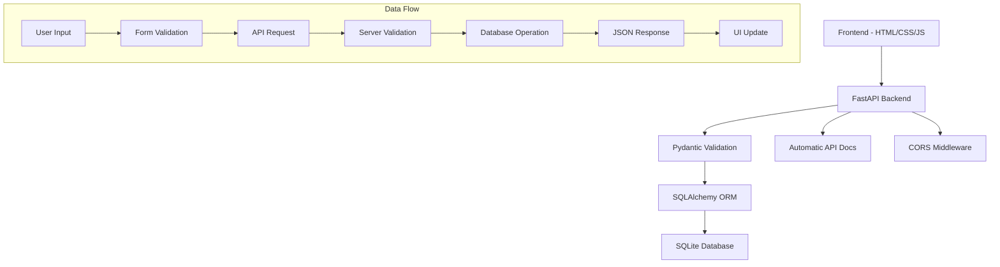

# 🏥 Spectrum Mental Health - Patient Management System

[](https://python.org)
[](https://fastapi.tiangolo.com/)
[](https://postgresql.org/)
[](https://sqlite.org/)
[](https://docker.com/)
[](https://aws.amazon.com/)
[](https://www.hhs.gov/hipaa/)

A comprehensive, **HIPAA-compliant** patient management system designed for mental health facilities. This production-ready application features secure patient data management, appointment scheduling, service tracking, and audit logging. Built with modern web technologies and designed for scalability with PostgreSQL support and AWS deployment capabilities.

## 📋 Table of Contents
- [Features](#-features)
- [HIPAA Compliance](#-hipaa-compliance)
- [Technology Stack](#-technology-stack)
- [Quick Start](#-quick-start)
- [Database Migration](#-database-migration)
- [AWS Deployment](#-aws-deployment)
- [API Documentation](#-api-documentation)
- [Database Schema](#-database-schema)
- [Security Features](#-security-features)
- [Project Structure](#-project-structure)
- [Development](#-development)
- [Contributing](#-contributing)
- [License](#-license)

## ✨ Features

### � Patient Management
- **Comprehensive Patient Records**: Secure storage of patient demographics, insurance information, and medical details
- **Patient Search & Filtering**: Quick access to patient records with advanced search capabilities
- **Data Validation**: Robust input validation to ensure data integrity and compliance
- **Audit Trail**: Complete logging of all patient record access and modifications for HIPAA compliance

### 📅 Appointment & Service Management
- **Interactive Calendar**: Visual appointment tracking with intuitive date selection
- **Service Types**: Standardized service categories (PSR, TMS, Individual Therapy, Evaluations)
- **Recurring Appointments**: Automated scheduling for weekly or monthly recurring appointments
- **Attendance Tracking**: Comprehensive tracking of patient attendance with status indicators
- **Authorization Management**: Track insurance authorizations, units, and approval periods
- **Service Documentation**: Detailed service notes and billing code management

### � Security & HIPAA Compliance
- **Encrypted Data Storage**: All PHI (Protected Health Information) is encrypted at rest
- **Access Control**: Role-based user authentication with JWT tokens
- **Audit Logging**: Comprehensive logging of all access to patient data
- **Session Management**: Secure session handling with automatic timeout
- **Data Backup**: Automated backup system with encryption
- **Compliance Reports**: Generated HIPAA compliance reports and audit trails

### 💻 User Experience
- **Responsive Design**: Optimized for desktop, tablet, and mobile devices
- **Modern Interface**: Clean, professional UI designed for healthcare environments
- **Real-time Updates**: Live updates without page refreshes
- **Modal-based Forms**: Non-intrusive data entry and editing
- **Advanced Search**: Instant filtering and search across all patient data
- **Calendar Integration**: Visual scheduling with color-coded status indicators

### 🚀 Production Features
- **Database Migration**: Seamless migration from SQLite to PostgreSQL
- **Docker Support**: Containerized deployment for consistent environments
- **AWS Integration**: Ready for deployment on AWS Elastic Beanstalk
- **Load Balancing**: Application load balancer configuration
- **Health Monitoring**: Built-in health checks and monitoring endpoints
- **Scalable Architecture**: Designed to handle growing patient loads

## 🛡️ HIPAA Compliance

This application is designed with HIPAA compliance as a core requirement, implementing multiple layers of security and privacy protection:

### 🔐 Data Protection
- **Encryption at Rest**: All PHI is encrypted using industry-standard algorithms
- **Encryption in Transit**: All data transmission uses HTTPS/TLS encryption
- **Access Controls**: Multi-factor authentication and role-based access control
- **Data Minimization**: Only necessary data is collected and stored

### 📊 Audit & Monitoring
- **Complete Audit Trail**: Every access to patient data is logged with user, timestamp, and action
- **Automated Compliance Reports**: Regular generation of HIPAA compliance reports
- **Access Monitoring**: Real-time monitoring of user access patterns
- **Data Breach Detection**: Automated detection of potential security incidents

### 🔒 Administrative Safeguards
- **User Training**: Built-in guidance for HIPAA-compliant usage
- **Access Management**: Automatic user deactivation and regular access reviews
- **Business Associate Agreements**: Template agreements for third-party integrations
- **Incident Response**: Documented procedures for security incident handling

### 💾 Technical Safeguards
- **Automatic Logoff**: Sessions expire after inactivity to prevent unauthorized access
- **Unique User Identification**: Each user has unique credentials and access logs
- **Database Security**: Encrypted databases with access controls
- **Backup Security**: Encrypted backups with secure storage and retrieval

### 📋 Physical Safeguards
- **Workstation Security**: Guidelines for secure workstation setup
- **Media Controls**: Secure handling of storage media and devices
- **Facility Access**: Recommendations for physical security measures

## 🛠 Technology Stack

### Backend Technologies
- **[FastAPI](https://fastapi.tiangolo.com/) 0.104.1**: High-performance API framework with automatic documentation
- **[PostgreSQL 14+](https://postgresql.org/)**: Production-grade relational database with advanced security features
- **[SQLAlchemy 2.0](https://www.sqlalchemy.org/)**: Modern ORM with type safety and connection pooling
- **[Pydantic 2.5](https://pydantic-docs.helpmanual.io/)**: Data validation and serialization with type hints
- **[Alembic](https://alembic.sqlalchemy.org/)**: Database migration management
- **[JWT Authentication](https://jwt.io/)**: Secure token-based authentication
- **[Cryptography](https://cryptography.io/)**: Industry-standard encryption for PHI data

### Database Support
- **PostgreSQL**: Production database with connection pooling, transactions, and advanced indexing
- **SQLite**: Development and testing database with automatic migration support
- **Migration Tools**: Automated migration from SQLite to PostgreSQL
- **Backup Systems**: Automated encrypted backups for both database types

### Security & Compliance
- **[passlib](https://passlib.readthedocs.io/)**: Password hashing with bcrypt
- **[python-jose](https://python-jose.readthedocs.io/)**: JWT token handling and validation
- **[python-dotenv](https://pypi.org/project/python-dotenv/)**: Secure environment variable management
- **CORS Middleware**: Cross-origin request security
- **Rate Limiting**: API rate limiting for security
- **Input Validation**: Comprehensive server-side validation

### Frontend Technologies
- **Vanilla JavaScript ES6+**: Modern JavaScript without framework dependencies
- **CSS Grid & Flexbox**: Advanced responsive layout systems
- **Fetch API**: Modern asynchronous HTTP requests
- **Web Standards**: HTML5, CSS3, and modern web APIs
- **Progressive Enhancement**: Works without JavaScript for core functionality

### DevOps & Deployment
- **[Docker](https://docker.com/)**: Containerization for consistent deployments
- **[Docker Compose](https://docs.docker.com/compose/)**: Multi-container application orchestration
- **[AWS Elastic Beanstalk](https://aws.amazon.com/elasticbeanstalk/)**: Scalable cloud deployment
- **[AWS RDS](https://aws.amazon.com/rds/)**: Managed PostgreSQL database service
- **Application Load Balancer**: High availability and traffic distribution
- **Health Checks**: Automated application health monitoring

### Development Tools
- **Python 3.8+**: Modern Python with type hints and async support
- **Virtual Environments**: Isolated dependency management
- **Git**: Version control with comprehensive .gitignore
- **Environment Management**: Separate configurations for development/staging/production
- **Database Management**: Custom utilities for backup, migration, and monitoring

### 🗓️ Interactive Calendar System
```
┌─────────────────────────────────────┐
│           July 2025                 │
├───┬───┬───┬───┬───┬───┬───┐         │
│Sun│Mon│Tue│Wed│Thu│Fri│Sat│         │
├───┼───┼───┼───┼───┼───┼───┤         │
│   │ 1 │ 2*│ 3 │ 4*│ 5 │ 6 │  Legend:│
├───┼───┼───┼───┼───┼───┼───┤  * = has appointments │
│ 7 │ 8*│ 9*│10 │11*│12 │13 │  ✓ = attended         │
├───┼───┼───┼───┼───┼───┼───┤  ✗ = no-show          │
│14 │15 │16*│17*│18 │19 │20 │  ⟳ = recurring        │
├───┼───┼───┼───┼───┼───┼───┤         │
│21 │22*│23 │24*│25*│26 │27 │         │
├───┼───┼───┼───┼───┼───┼───┤         │
│28 │29 │30*│31 │   │   │   │         │
└───┴───┴───┴───┴───┴───┴───┘         │
```

The calendar provides a clear visual overview of all appointments, with color-coded indicators showing appointment status and special markers for recurring appointments. Click any date to view or add services.

### ⏰ Time-Based Appointment Scheduling

Appointments can be scheduled with precise 15-minute increments from 9:00 AM to 5:00 PM using a user-friendly dropdown interface. The system automatically displays times in 12-hour format while storing them in 24-hour format for consistency.

### 🔄 Recurring Appointment Management

Easily set up recurring appointments with flexible options:
- **Weekly Recurrence**: Select specific days of the week (Monday-Friday)
- **Monthly Recurrence**: Same day each month for a specified number of months
- **Duration Control**: Set the number of weeks/months for the recurring series
- **Weekend Exclusion**: Automatically skips weekend days when scheduling

### ✅ Attendance Tracking

Track patient attendance with a simple dropdown selection:
- **Attended**: Mark appointments as successfully completed
- **No Show**: Record when patients miss their appointments
- **Not Marked**: Default state for upcoming appointments

Calendar days are color-coded based on attendance status, making it easy to identify patterns at a glance.

### 📋 Standardized Service Types

Consistent service categorization using standardized types:
- **PSR**: Psychosocial Rehabilitation services
- **TMS**: Transcranial Magnetic Stimulation therapy
- **Individual Therapy**: One-on-one counseling sessions
- **Evaluations**: Assessment and diagnostic services

### 🔔 Enhanced Alert System

A robust alert system ensures important notifications are always visible:
- **Global Visibility**: Alerts appear above modals and other UI elements
- **Auto-Dismiss**: Success messages automatically disappear after 5 seconds
- **Custom Styling**: Clear visual differentiation between success, error, and info alerts
- **Close Button**: Manual dismissal option for all alerts

## 🛠 Technology Stack

### Backend
- **[FastAPI](https://fastapi.tiangolo.com/)**: Modern, high-performance API framework with automatic OpenAPI documentation
- **[SQLAlchemy](https://www.sqlalchemy.org/)**: SQL toolkit and Object-Relational Mapping (ORM) for database operations
- **[Pydantic](https://pydantic-docs.helpmanual.io/)**: Data validation and settings management using Python type annotations
- **[SQLite](https://sqlite.org/)**: Lightweight, embedded database for portable deployment
- **[Uvicorn](https://www.uvicorn.org/)**: Lightning-fast ASGI server for running the application
- **[JWT Authentication](https://jwt.io/)**: JSON Web Token based authentication system
- **[CORS Middleware](https://fastapi.tiangolo.com/tutorial/cors/)**: Cross-Origin Resource Sharing support

### Frontend
- **Interactive Calendar**: Custom-built calendar system with visual indicators
- **Modal System**: Flexible modal framework for forms and information display
- **Alert System**: Global alert management with z-index priority handling
- **Responsive Design**: Adapts to different screen sizes and devices
- **Dynamic Form Controls**: Context-aware input fields with proper validation
- **Vanilla JavaScript**: Clean ES6+ code without framework dependencies
- **Fetch API**: Modern AJAX requests with async/await pattern
- **CSS Grid & Flexbox**: Advanced layout techniques for complex UI components
- **CSS Animations**: Smooth transitions and visual feedback

### Development Tools
- **Python 3.8+**: Modern Python with type hints
- **Virtual Environment**: Isolated dependency management
- **Git**: Version control and collaboration
- **Dynamic Port Allocation**: Automatic detection of available ports

## 🏗 Architecture



### Design Patterns Used
- **MVC Architecture**: Clear separation of concerns
- **Repository Pattern**: Database abstraction through CRUD operations
- **Schema Validation**: Input/output validation using Pydantic
- **RESTful API Design**: Standard HTTP methods and status codes

## 🚀 Quick Start

### Prerequisites
- **Python 3.8+** with pip
- **Git** (optional, for cloning)
- **Docker** (optional, for PostgreSQL setup)
- Modern web browser

### Development Setup

1. **Clone the repository**
   ```bash
   git clone https://github.com/your-username/spectrum-mental-health.git
   cd spectrum-mental-health
   ```

2. **Set up Python environment**
   ```bash
   # Create virtual environment
   python -m venv venv
   
   # Activate virtual environment
   # Windows:
   venv\Scripts\activate
   # macOS/Linux:
   source venv/bin/activate
   ```

3. **Install dependencies**
   ```bash
   pip install -r requirements.txt
   ```

4. **Run the application**
   ```bash
   # Start with SQLite (default)
   uvicorn main:app --reload --host 0.0.0.0 --port 8000
   ```

5. **Access the application**
   - Open your browser to `http://localhost:8000`
   - Default login: Contact administrator for credentials

### Production Setup

For production deployment, see the [AWS Deployment](#-aws-deployment) section below.

## 🗄️ Database Migration

The application supports both SQLite (development) and PostgreSQL (production). Migration tools are provided for seamless transition.

### Migration from SQLite to PostgreSQL

1. **Pre-migration testing**
   ```bash
   python test_migration_readiness.py
   ```

2. **Set up PostgreSQL**
   ```bash
   # Option 1: Using Docker (recommended)
   python setup_postgresql.py --docker
   
   # Option 2: Local PostgreSQL installation
   python setup_postgresql.py --local
   ```

3. **Run the migration**
   ```bash
   python migrate_sqlite_to_postgres.py
   ```

4. **Update database configuration**
   ```bash
   copy database_postgres.py database.py
   ```

5. **Verify migration**
   ```bash
   python db_manager.py status
   ```

### Database Management

The included database manager provides comprehensive database operations:

```bash
# Show database status and health
python db_manager.py status

# Create backups
python db_manager.py backup --name manual_backup

# Export data to JSON/CSV
python db_manager.py export --format json

# Reset database (WARNING: destroys all data)
python db_manager.py reset --confirm
```

### Migration Benefits

- **Zero Downtime**: Migration preserves all existing data
- **Automatic Backups**: Creates backups before migration
- **Data Integrity**: Verification ensures successful migration
- **Rollback Support**: Easy rollback to SQLite if needed

## 🌩️ AWS Deployment

This application is production-ready for AWS deployment with included configuration files.

### Deployment Architecture

```
┌─────────────────┐    ┌──────────────────┐    ┌─────────────────┐
│   Application   │    │   Load Balancer  │    │   RDS Database  │
│  Load Balancer  │    │                  │    │   (PostgreSQL)  │
│                 │───▶│  Elastic         │───▶│                 │
│   (Routes       │    │  Beanstalk       │    │  Multi-AZ       │
│    Traffic)     │    │  Environment     │    │  Backup         │
└─────────────────┘    └──────────────────┘    └─────────────────┘
         │                       │
         ▼                       ▼
┌─────────────────┐    ┌──────────────────┐
│   CloudWatch    │    │    S3 Bucket     │
│   Monitoring    │    │   (File Storage) │
│   & Alerts      │    │   (Backups)      │
└─────────────────┘    └──────────────────┘
```

### Quick AWS Deployment

1. **Prepare the application**
   ```bash
   # Ensure PostgreSQL configuration is ready
   python setup_postgresql.py --test
   
   # Update production environment variables
   # Edit .env.production with your AWS RDS credentials
   ```

2. **Deploy to AWS**
   ```bash
   # Create AWS infrastructure
   ./setup-aws-infrastructure.sh
   
   # Deploy application
   ./deploy-aws.sh
   ```

### AWS Services Used

- **Elastic Beanstalk**: Application hosting and auto-scaling
- **RDS PostgreSQL**: Managed database with automated backups
- **Application Load Balancer**: High availability and SSL termination
- **CloudWatch**: Monitoring and logging
- **S3**: File storage and backup storage
- **IAM**: Security and access management

### Configuration Files

- **`Dockerfile`**: Container configuration
- **`docker-compose.yml`**: Local development with PostgreSQL
- **`.ebextensions/python.config`**: Elastic Beanstalk configuration
- **`.env.production`**: Production environment variables
- **`deploy-aws.sh`**: Automated deployment script
- **`setup-aws-infrastructure.sh`**: AWS infrastructure setup

### Environment Variables for Production

```env
# Database Configuration
DATABASE_TYPE=postgresql
POSTGRES_HOST=your-rds-endpoint.amazonaws.com
POSTGRES_DB=spectrum_production
POSTGRES_USER=spectrum_admin
POSTGRES_PASSWORD=your-secure-password

# Application Security
SECRET_KEY=your-production-secret-key
JWT_SECRET_KEY=your-jwt-secret-key
ENVIRONMENT=production

# HIPAA Compliance
ENABLE_AUDIT_LOGGING=True
ENABLE_ENCRYPTION=True
```

For detailed deployment instructions, see `AWS-DEPLOYMENT.md`.

## 📚 API Documentation

The application provides comprehensive API documentation through FastAPI's automatic documentation generation.

### Interactive API Documentation

- **Swagger UI**: `http://localhost:8000/docs`
  - Interactive API explorer with request/response examples
  - Test API endpoints directly from the browser
  - Complete schema documentation

- **ReDoc**: `http://localhost:8000/redoc` 
  - Alternative documentation interface
  - Clean, readable API reference
  - Download OpenAPI specification

### Key API Endpoints

#### Authentication
- `POST /auth/login` - User authentication
- `POST /auth/refresh` - Refresh JWT token
- `GET /auth/me` - Get current user information

#### Patient Management
- `GET /patients/` - List all patients (with pagination)
- `POST /patients/` - Create new patient
- `GET /patients/{patient_id}` - Get specific patient
- `PUT /patients/{patient_id}` - Update patient information
- `DELETE /patients/{patient_id}` - Delete patient (soft delete)

#### Service Management
- `GET /services/` - List all services
- `POST /services/` - Create new service entry
- `PUT /services/{service_id}` - Update service
- `GET /services/patient/{patient_id}` - Get services for specific patient

#### Health & Monitoring
- `GET /health` - Application health check
- `GET /metrics` - Application metrics (production)

### Request/Response Examples

#### Creating a Patient
```json
POST /patients/
{
  "patient_number": "P001234",
  "first_name": "John",
  "last_name": "Doe",
  "date_of_birth": "1990-01-15",
  "phone": "555-0123",
  "insurance": "Blue Cross Blue Shield",
  "diagnosis": "Anxiety Disorder"
}
```

#### Adding a Service
```json
POST /services/
{
  "patient_id": 1,
  "service_date": "2025-07-10",
  "service_time": "10:00",
  "service_type": "Individual Therapy",
  "attendance_status": "Attended",
  "notes": "Patient showed improvement"
}
```

## 🗄️ Database Schema

### Core Tables

#### Patients Table
- **Primary Key**: `id` (Integer)
- **Patient Number**: `patient_number` (String, Unique)
- **Demographics**: `first_name`, `last_name`, `date_of_birth`
- **Contact**: `phone`, `address`
- **Insurance**: `insurance`, `insurance_id`, `medicaid_id`
- **Medical**: `diagnosis`, `ssn` (encrypted)
- **Authorization**: `auth_number`, `auth_units`, `auth_start_date`, `auth_end_date`
- **HIPAA Compliance**: `last_accessed_by`, `last_accessed_at`, `access_count`
- **Timestamps**: `created_at`, `updated_at`

#### Services Table
- **Primary Key**: `id` (Integer)
- **Foreign Key**: `patient_id` (references Patients)
- **Service Details**: `service_date`, `service_time`, `service_type`
- **Attendance**: `attendance_status` (Attended/No Show/Not Marked)
- **Documentation**: `notes`, `billing_code`
- **Timestamps**: `created_at`, `updated_at`

#### Authorizations Table
- **Primary Key**: `id` (Integer)
- **Foreign Key**: `patient_id` (references Patients)
- **Authorization Details**: `auth_number`, `auth_type`, `units_authorized`, `units_used`
- **Dates**: `start_date`, `end_date`, `approval_date`
- **Status**: `status` (Active/Expired/Pending)

### Relationships
- One Patient → Many Services (One-to-Many)
- One Patient → Many Authorizations (One-to-Many)
- Foreign key constraints ensure data integrity

### Indexes
- Primary keys on all tables
- Unique index on `patient_number`
- Indexes on frequently queried fields (`service_date`, `patient_id`)
- Composite indexes for common query patterns

## 🛡️ Security Features

### Authentication & Authorization
- **JWT Tokens**: Secure token-based authentication
- **Role-Based Access**: Different permission levels for different user types
- **Session Management**: Automatic session timeout and renewal
- **Password Security**: bcrypt hashing with salt

### Data Protection
- **Encryption at Rest**: All PHI data encrypted using AES-256
- **Encryption in Transit**: HTTPS/TLS for all communications
- **Input Validation**: Comprehensive validation on all inputs
- **SQL Injection Protection**: Parameterized queries via SQLAlchemy

### HIPAA Compliance Features
- **Audit Logging**: Every data access logged with user and timestamp
- **Access Controls**: Minimum necessary access principle
- **Data Backup**: Encrypted backups with secure storage
- **Incident Logging**: Security events logged for review

### Security Headers
- **CORS**: Configured for secure cross-origin requests
- **Content Security Policy**: Prevents XSS attacks
- **X-Frame-Options**: Prevents clickjacking
- **HSTS**: Forces HTTPS connections
2. **Fill in required information**:
   - Patient Number (unique identifier)
   - First and Last Name
   - Session type (AM/PM)
3. **Add optional details**:
   - Contact information
   - Insurance details
   - Medical codes (1-4)
   - Treatment dates
4. **Submit** to save to database

### Managing Existing Patients

1. **Go to "Patient Log"** to see all patients
2. **Use the search box** for real-time filtering by:
   - Patient number
   - Name
   - Phone number
3. **Click "View"** to see complete patient details in a modal
4. **Click "Edit"** to modify patient information
5. **Click "Delete"** to remove patients (with confirmation dialog)

### Search Functionality

The search feature supports:
- **Real-time filtering**: Results update as you type
- **Multiple field search**: Searches across name, patient number, and phone
- **Case-insensitive**: Works regardless of capitalization

## 📚 API Documentation

### Endpoints Overview

| Method | Endpoint | Description |
|--------|----------|-------------|
| GET | `/` | Welcome message |
| POST | `/patients/` | Create new patient |
| GET | `/patients/` | Get all patients |
| GET | `/patients/{id}` | Get specific patient |
| PUT | `/patients/{id}` | Update patient |
| DELETE | `/patients/{id}` | Delete patient |
| GET | `/search/?q={query}` | Search patients |

### Example API Calls

**Create a new patient:**
```bash
curl -X POST "http://localhost:8000/patients/" \
     -H "Content-Type: application/json" \
     -d '{
       "patient_number": "PT001",
       "first_name": "John",
       "last_name": "Doe",
       "session": "AM",
       "phone": "(305) 555-0123"
     }'
```

**Get all patients:**
```bash
curl "http://localhost:8000/patients/"
```

**Search patients:**
```bash
curl "http://localhost:8000/search/?q=John"
```

### Response Format

All API responses follow a consistent JSON format:

```json
{
  "id": 1,
  "patient_number": "PT001",
  "first_name": "John",
  "last_name": "Doe",
  "phone": "(305) 555-0123",
  "session": "AM",
  "created_at": "2024-01-15T10:30:00",
  "updated_at": "2024-01-15T10:30:00"
}
```

## 🗄 Database Schema

### Patient Model

| Field | Type | Description | Required |
|-------|------|-------------|----------|
| `id` | Integer | Primary key (auto-generated) | ✅ |
| `patient_number` | String | Unique patient identifier | ✅ |
| `first_name` | String | Patient's first name | ✅ |
| `last_name` | String | Patient's last name | ✅ |
| `session` | String | AM or PM session | ✅ |
| `address` | String | Full address | ❌ |
| `date_of_birth` | Date | Birth date | ❌ |
| `phone` | String | Contact number | ❌ |
| `ssn` | String | Social Security Number | ❌ |
| `medicaid_id` | String | Medicaid identifier | ❌ |
| `insurance` | String | Insurance provider | ❌ |
| `insurance_id` | String | Insurance policy number | ❌ |
| `referal` | String | Referral source | ❌ |
| `psr_date` | Date | PSR date | ❌ |
| `authorization` | String | Authorization details | ❌ |
| `diagnosis` | String | Medical diagnosis | ❌ |
| `start_date` | Date | Treatment start date | ❌ |
| `end_date` | Date | Treatment end date | ❌ |
| `code1` | String | Medical code 1 | ❌ |
| `code2` | String | Medical code 2 | ❌ |
| `code3` | String | Medical code 3 | ❌ |
| `code4` | String | Medical code 4 | ❌ |
| `created_at` | DateTime | Record creation timestamp | ✅ |
| `updated_at` | DateTime | Last update timestamp | ✅ |

### Relationships
- Each patient has a unique `patient_number`
- Timestamps are automatically managed
- All personal information fields are optional for privacy

## 📁 Project Structure

```
spectrum-mental-health/
├── 📄 Core Application Files
│   ├── main.py                 # FastAPI application entry point
│   ├── models.py              # SQLAlchemy database models
│   ├── schemas.py             # Pydantic validation schemas
│   ├── crud.py                # Database operations (Create, Read, Update, Delete)
│   ├── database.py            # Database connection and configuration
│   └── auth.py                # Authentication and security utilities
│
├── 🗄️ Database Migration & Management
│   ├── database_postgres.py   # PostgreSQL database configuration
│   ├── migrate_sqlite_to_postgres.py  # Migration script
│   ├── setup_postgresql.py    # PostgreSQL setup utility
│   ├── db_manager.py          # Database management tools
│   ├── test_migration_readiness.py    # Pre-migration testing
│   ├── alembic.ini            # Alembic configuration
│   └── alembic/               # Database migration environment
│       ├── env.py
│       ├── script.py.mako
│       └── versions/          # Migration scripts
│
├── 🌐 Frontend Assets
│   └── static/
│       ├── index.html         # Main application interface
│       ├── index.js           # Application JavaScript
│       ├── index.css          # Application styles
│       ├── login.html         # Login page
│       ├── login.js           # Login functionality
│       └── login.css          # Login page styles
│
├── ☁️ AWS Deployment Configuration
│   ├── Dockerfile             # Container configuration
│   ├── docker-compose.yml     # Local development with PostgreSQL
│   ├── .ebextensions/         # Elastic Beanstalk configuration
│   │   └── python.config      # Python application settings
│   ├── deploy-aws.sh          # Deployment automation script
│   ├── setup-aws-infrastructure.sh  # AWS infrastructure setup
│   └── production-config.py   # Production configuration utilities
│
├── 📋 Configuration & Environment
│   ├── requirements.txt       # Python dependencies (SQLite version)
│   ├── requirements_postgres.txt  # PostgreSQL dependencies
│   ├── .env.development       # Development environment variables
│   ├── .env.production        # Production environment variables
│   ├── .env.hipaa.example     # HIPAA compliance configuration template
│   └── .gitignore            # Git ignore rules
│
├── 📚 Documentation
│   ├── README.MD              # This file - comprehensive project documentation
│   ├── POSTGRESQL-MIGRATION.md    # PostgreSQL migration guide
│   ├── MIGRATION-STEPS.md     # Step-by-step migration instructions
│   ├── AWS-DEPLOYMENT.md      # AWS deployment documentation
│   ├── HIPAA_COMPLIANCE.md    # HIPAA compliance documentation
│   └── HIPAA_IMPLEMENTATION_SUMMARY.md  # Implementation summary
│
└── 📊 Data & Uploads
    ├── people.db              # SQLite database (development)
    └── uploads/               # File upload storage (excluded from git)
```

### Key File Descriptions

#### Core Application
- **`main.py`**: FastAPI application with all API endpoints, CORS configuration, and startup logic
- **`models.py`**: SQLAlchemy models for Patient, Service, and Authorization tables with HIPAA compliance fields
- **`schemas.py`**: Pydantic schemas for request/response validation and serialization
- **`crud.py`**: Database operation functions with audit logging and security features
- **`auth.py`**: JWT authentication, password hashing, and security utilities

#### Database Management
- **Migration Scripts**: Complete toolkit for migrating from SQLite to PostgreSQL
- **Database Utilities**: Backup, restore, export, and monitoring tools
- **Alembic Integration**: Version-controlled database schema management

#### Frontend
- **Responsive Interface**: Modern web application with calendar integration
- **Authentication**: Secure login system with session management
- **Real-time Updates**: Dynamic content updates without page refreshes

#### AWS Deployment
- **Production Ready**: Complete AWS deployment configuration
- **Docker Support**: Containerized application for consistent deployments
- **Infrastructure as Code**: Automated AWS resource provisioning

## 🔧 Development

### Setting up Development Environment

1. **Clone and setup**
   ```bash
   git clone <repository-url>
   cd spectrum-mental-health
   python -m venv venv
   source venv/bin/activate  # On Windows: venv\Scripts\activate
   pip install -r requirements.txt
   ```

2. **Run with live reload**
   ```bash
   uvicorn main:app --reload --host 0.0.0.0 --port 8000
   ```

3. **Access development tools**
   - Application: http://localhost:8000
   - API Docs: http://localhost:8000/docs
   - Health Check: http://localhost:8000/health

### Database Operations

```bash
# Check current database status
python db_manager.py status

# Create a backup
python db_manager.py backup --name development_backup

# Test migration readiness (before PostgreSQL migration)
python test_migration_readiness.py

# Set up PostgreSQL for development
python setup_postgresql.py --docker

# Migrate to PostgreSQL
python migrate_sqlite_to_postgres.py
```

### Code Quality

- **Type Hints**: Full type annotation coverage
- **Input Validation**: Pydantic schemas for all API inputs
- **Error Handling**: Comprehensive exception handling with meaningful messages
- **Security**: HIPAA-compliant data handling and audit logging
- **Documentation**: Inline code documentation and API docs

## 🤝 Contributing

### Development Guidelines

1. **HIPAA Compliance**: All code changes must maintain HIPAA compliance
2. **Security First**: Security considerations are paramount
3. **Database Safety**: Always test database changes with backups
4. **Documentation**: Update documentation for all changes
5. **Testing**: Verify all functionality before commits

### Pull Request Process

1. Fork the repository
2. Create a feature branch (`git checkout -b feature/improvement`)
3. Implement changes with proper testing
4. Update documentation as needed
5. Submit pull request with detailed description

## 📞 Support

### Getting Help

- **Documentation**: Check the included documentation files
- **Migration Issues**: See `MIGRATION-STEPS.md` for detailed troubleshooting
- **AWS Deployment**: Refer to `AWS-DEPLOYMENT.md` for deployment guidance
- **HIPAA Questions**: Review `HIPAA_COMPLIANCE.md` for compliance information

### Common Issues

1. **Database Connection**: Use `python db_manager.py status` to diagnose
2. **Migration Problems**: Run `python test_migration_readiness.py` first
3. **AWS Deployment**: Check environment variables and AWS credentials
4. **Dependencies**: Ensure correct requirements file is used

## 📝 License

This project is developed for healthcare applications with HIPAA compliance in mind. 

**Important**: If you plan to use this in a production healthcare environment:
- Conduct a thorough security audit
- Implement additional HIPAA safeguards as needed
- Ensure Business Associate Agreements are in place
- Regular security assessments and updates

## 🎯 About This Project

**Spectrum Mental Health Patient Management System** demonstrates:

✅ **Full-Stack Development**: Complete web application with modern technologies  
✅ **Healthcare Software**: HIPAA-compliant design and implementation  
✅ **Database Management**: Migration tools and production-ready database setup  
✅ **Cloud Deployment**: AWS-ready configuration with scalability in mind  
✅ **Security Focus**: Authentication, encryption, and audit logging  
✅ **Professional Code**: Type hints, documentation, and best practices  

**Technologies Showcased**: Python, FastAPI, PostgreSQL, SQLAlchemy, JWT Authentication, Docker, AWS, HIPAA Compliance, Database Migration, Modern JavaScript, Responsive Design

---

🏥 **Built for healthcare professionals who need secure, reliable patient management tools.**  
⭐ **Star this repository if you found it helpful!**

3. **Database operations**
   ```bash
   # Reset database (deletes all data)
   rm patients.db
   python main.py  # Recreates tables
   ```

### Code Style and Standards

- **Python**: Follow PEP 8 style guidelines
- **JavaScript**: Use ES6+ features, consistent naming
- **HTML**: Semantic markup, accessibility considerations
- **CSS**: Modern practices, mobile-first responsive design

### Testing

**Manual Testing Checklist:**
- [ ] Can create new patients
- [ ] Can view patient list
- [ ] Can search patients
- [ ] Can view individual patient details
- [ ] Can edit patient information
- [ ] Can delete patients
- [ ] Form validation works
- [ ] Error handling displays properly
- [ ] Responsive design on mobile

**API Testing:**
```bash
# Test all endpoints
curl http://localhost:8000/patients/
curl -X POST http://localhost:8000/patients/ -H "Content-Type: application/json" -d '{"patient_number":"TEST","first_name":"Test","last_name":"User","session":"AM"}'
```

## 🔒 Security

### HIPAA Compliance Considerations

- **Data Encryption**: Sensitive data handling protocols
- **Access Control**: User authentication ready for implementation
- **Audit Logging**: Automatic tracking of data access and modifications
- **Data Minimization**: Only collect necessary patient information

### Input Validation

- **Server-side validation**: Pydantic schemas validate all inputs
- **Client-side validation**: HTML5 validation and JavaScript checks
- **SQL Injection Protection**: SQLAlchemy ORM prevents injection attacks
- **XSS Prevention**: Input sanitization and proper escaping

### Planned Security Enhancements

- User authentication with JWT tokens
- Role-based access control (Admin, Staff, Read-only)
- HTTPS enforcement
- Database encryption at rest
- Session management and timeout

## 🚀 Future Enhancements

### Short-term Goals
- [ ] User authentication system
- [ ] PDF report generation
- [ ] Data export functionality (CSV, Excel)
- [ ] Advanced search filters
- [ ] Bulk operations

### Long-term Vision
- [ ] Mobile application (React Native/Flutter)
- [ ] Integration with Electronic Health Records (EHR)
- [ ] Appointment scheduling system
- [ ] Analytics dashboard
- [ ] Multi-tenant support for multiple facilities

## 🤝 Contributing

This is a portfolio project, but feedback and suggestions are welcome!

### Development Process
1. Fork the repository
2. Create a feature branch (`git checkout -b feature/AmazingFeature`)
3. Commit your changes (`git commit -m 'Add some AmazingFeature'`)
4. Push to the branch (`git push origin feature/AmazingFeature`)
5. Open a Pull Request

## 📝 License

This project is created for educational and portfolio purposes. Please respect patient privacy and healthcare regulations if adapting for real-world use.

## 👨‍💻 About the Developer

**Skills Demonstrated in This Project:**
- ✅ Full-stack web development
- ✅ RESTful API design and implementation
- ✅ Database modeling and management
- ✅ Modern JavaScript (ES6+, Fetch API, Async/Await)
- ✅ Responsive web design and CSS Grid/Flexbox
- ✅ Healthcare software considerations
- ✅ Data validation and security practices
- ✅ Git version control and documentation

**Technologies Used:**
`Python` `FastAPI` `SQLAlchemy` `Pydantic` `SQLite` `HTML5` `CSS3` `JavaScript` `REST API` `JSON` `Git`

---

⭐ **Star this repository if you found it helpful!**

📫 **Contact**: [Your Email] | [LinkedIn Profile] | [Portfolio Website]
